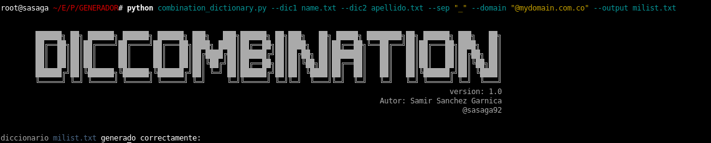
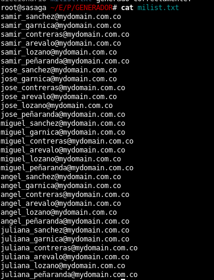

# combination_dictionary

combination_dictionary Es un script escrito totalmente en python que te permitira generar correos electronico apartir de dos listas de datos.


Ejemplo de uso para generar la lista de correos electronicos
```
python combination_dictionary.py --dic1 name.txt --dic2 apellido.txt --sep "_" --domain "@mydomain.com.co" --output milist.txt

```



Resultado de la generacion de correos 




Puedes colaborar a que siga creando nuevas herramientas con una donación en [Paypal](https://www.paypal.com) al correo ssanchezga@ufpso.edu.co
by [@sasaga92](https://twitter.com/sasaga92)


:heart_eyes: happy hacking!!!
